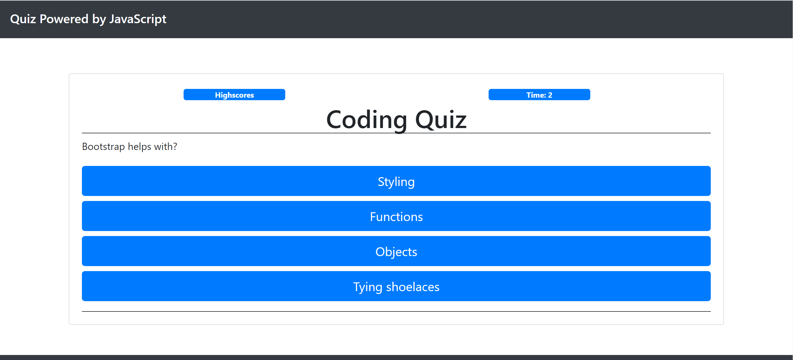

# Javascript Quiz

## About The Repository

### Summary

This repository contains a quiz powered by Javascript. This quiz utilizes Javascript to:

- Set a timer for the quiz when the start button is pressed
- Cycles through 5 preset multiple choice questions
- Saves your score to localStorage
- Allows the user to clear Highscores if desired

### Quiz rules

This is a 1 minute timed quiz. As the user answers each question the quiz will validate if the answer was right or wrong. If the answer is right the user will earn 100 points. If the answer is wrong the user will earn 0 points and will have 10 seconds reduced from the timer. The quiz ends when the time runs out of time or the user answers all of the 5 questions.

## Website Mock

Website URL: https://jrkrichards.github.io/js_powered_quiz/

### Coding Quiz:

Start:

Questions:

Score Submission:

End:

End:

